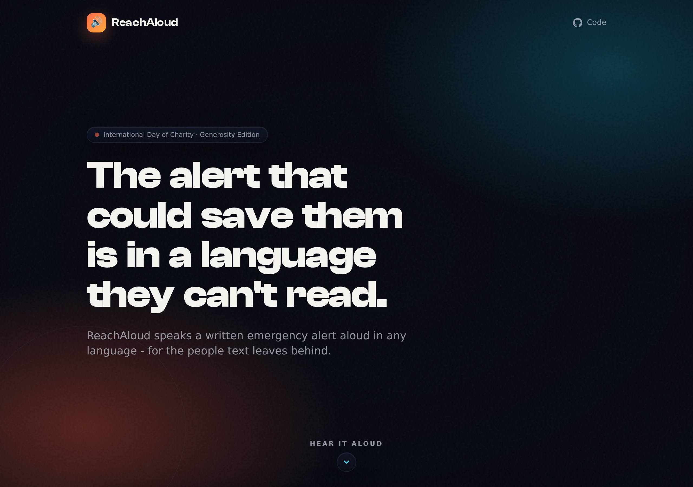

<div align="center">

# 🔊 ReachAloud

### Emergency alerts, spoken aloud in every language

**The last-mile comprehension layer for emergency alerts.** ReachAloud turns a written
warning into clear, natural, offline-capable spoken audio in any language, for the people
that text-only alerts leave behind: low-literacy, low-vision, and non-native readers.

[](https://simplynadaf.github.io/reachaloud/)
[](https://dev.to/sarvar_04/reachaloud-i-built-a-multilingual-voice-tool-that-reads-emergency-alerts-aloud-for-people-who-15ho)
[](https://elevenlabs.io)


<br />

<!-- ============================================================= -->
<!-- SCREENSHOT: replace with a real 1200px-wide capture of the hero + composer -->
<!-- Save it to assets/screenshot-hero.png and it will render here.              -->
<!-- ============================================================= -->


<br /><br />

<!-- ============================================================= -->
<!-- YOUTUBE DEMO                                                                -->
<!-- The image link makes the GitHub README show a clickable video thumbnail.    -->
<!-- ============================================================= -->

### ▶️ Watch the 2-minute demo

[](https://youtu.be/X0yQTw4slhE)

</div>

---

## Why this exists

When a flash flood hits, the warning goes out as text: an SMS, a banner, a push
notification. But a written alert only helps the people who can read it, on a screen
they can see, in a language they know. In a mixed, high-stress crowd (elderly villagers,
someone who is blind, a trekker who does not speak the local language) the alert that
could save a life arrives in a form they cannot use.

ReachAloud is dedicated to the more than 1,200 people lost in the
[2026 Nepal-Tibet floods](https://en.wikipedia.org/wiki/2026_Nepal%E2%80%93Tibet_floods).
It does not detect disasters or send warnings. It makes the warning that already exists
**understandable to everyone it reaches.**

## What it does

- 🌐 **Speaks any alert in any language** using ElevenLabs' `eleven_multilingual_v2`
  model, which auto-detects the language of the text you type.
- 📢 **Emergency broadcast mode**: a full-screen, high-contrast takeover that plays the
  alert aloud and cycles a giant caption through every language, so it serves people who
  cannot read the screen (voice) *and* people who cannot hear it (large text).
- 🔁 **Play in every language** back-to-back, for mixed crowds where locals and visitors
  need the same warning in turn.
- 📶 **Works offline.** A service worker pre-caches the app and every alert clip, so the
  audio still plays when a disaster has knocked out connectivity.
- ⬇️ **Download and share** each alert as an MP3 for a WhatsApp group, a village
  loudspeaker, or a printed QR poster at a trailhead.
- 🎁 **Hear your own alert with zero backend.** Paste your own free ElevenLabs API key and
  the browser calls ElevenLabs directly. The key stays in your browser and is optional.

## Honest scope: what ReachAloud is and is not

| ✅ It is | ⭕ It is not |
| --- | --- |
| The comprehension / last-mile layer that turns a warning into spoken voice | An early-warning or disaster-detection system |
| A tool that makes existing alerts understandable in any language | A replacement for official warning channels |
| Offline-capable once loaded, no account needed for the demo | A claim to save lives on its own |

## Live demo

👉 **[simplynadaf.github.io/reachaloud](https://simplynadaf.github.io/reachaloud/)**

No sign-up needed. The six pre-generated flood alerts play instantly with zero API calls.
To hear your own text, click **Hear it now** and paste a free ElevenLabs key.

### Demo languages

The demo ships one flood-evacuation alert rendered in six languages, centered on the
South Asian flood context plus the languages a mixed border/trekking crowd would need:

| Language | Native | Code |
| --- | --- | --- |
| English | English | `en` |
| Nepali | नेपाली | `ne` |
| Marathi | मराठी | `mr` |
| Hindi | हिन्दी | `hi` |
| Arabic | العربية | `ar` |
| Chinese | 中文 | `zh` |

## How it works

ReachAloud runs in two modes, and it is designed so the demo is bulletproof even with no
keys and no network.

```
                         ┌──────────────────────────────────────────┐
                         │              index.html (SPA)             │
                         │   Tailwind + GSAP, no build step          │
                         └───────────────┬───────────────┬──────────┘
                                         │               │
                 ┌───────────────────────┘               └──────────────────────┐
                 ▼                                                               ▼
   ┌─────────────────────────────┐                          ┌────────────────────────────────┐
   │  STATIC (default, no keys)  │                          │   LIVE (optional, type anything) │
   │                             │                          │                                  │
   │  audio/demo/*.mp3           │                          │  A) Hear it now (no backend):    │
   │  pre-generated clips        │                          │     browser -> api.elevenlabs.io │
   │  served by GitHub Pages     │                          │     with the user's own key      │
   │  + service worker (offline) │                          │                                  │
   │                             │                          │  B) api/speak.js (Vercel):       │
   │                             │                          │     browser -> your function ->  │
   │                             │                          │     ElevenLabs (key server-side) │
   └─────────────────────────────┘                          └────────────────────────────────┘
```

- **Static mode** (what GitHub Pages serves): six MP3s + a `manifest.json` the frontend
  reads to build the language cards. Zero API calls, zero quota, works offline. This is
  the judge-proof path.
- **Live mode A - Hear it now** (no server): the browser calls ElevenLabs directly with a
  key the user pastes. The key lives only in `localStorage` (opt-in) and is sent only to
  `api.elevenlabs.io`. This gives live, type-anything TTS on a pure static host.
- **Live mode B - serverless proxy** (optional): deploy `api/speak.js` to Vercel and the
  ElevenLabs key stays server-side, never in the browser.

## Tech stack

| Layer | Choice | Why |
| --- | --- | --- |
| Voice | **ElevenLabs** `eleven_multilingual_v2` | One model speaks every language from the same text; natural, calm delivery |
| Frontend | Single `index.html` (Tailwind + GSAP via CDN) | No build step, deploys anywhere static |
| Offline | Service Worker + Web App Manifest | Alert still plays when the network is down |
| Live TTS (optional) | Vercel serverless function `api/speak.js` | Keeps the API key off the client |
| Hosting | GitHub Pages (static) or Vercel (live) | Free, instant, no infra to run |

## Project structure

```
reachaloud/
├── index.html                # the entire single-page app (UI + logic)
├── config.js                 # runtime config: API_BASE ("" = pure static)
├── sw.js                     # service worker (offline app shell + clips)
├── manifest.webmanifest      # PWA manifest
├── og.jpg                    # social share image (1200x630)
├── api/
│   └── speak.js              # optional Vercel TTS proxy (key stays server-side)
├── audio/demo/
│   ├── manifest.json         # language list + alert text the UI reads
│   └── alert_*.mp3           # 6 pre-generated flood alerts (en, ne, mr, hi, ar, zh)
├── assets/
│   └── og-template.html      # source used to render og.jpg
└── scripts/
    └── generate_demo.py      # regenerate the demo clips from ElevenLabs
```

## Run it locally

No build, no dependencies. Just serve the folder:

```bash
git clone https://github.com/simplynadaf/reachaloud.git
cd reachaloud
python3 -m http.server 8000
# open http://localhost:8000
```

## Deploy

### GitHub Pages (static, what the live demo uses)

1. Push to GitHub.
2. **Settings → Pages → Deploy from branch → `main` / root.**
3. Visit `https://<user>.github.io/reachaloud/`.

`config.js` ships with `API_BASE: ""`, so Pages runs in pure-static mode and the six demo
clips carry the whole experience. A `.nojekyll` file keeps Pages from touching the assets.

### Vercel (optional live, type-anything TTS)

1. Deploy the repo to Vercel; it picks up `api/speak.js` as a serverless function.
2. Add an `ELEVENLABS_API_KEY` environment variable in the Vercel project.
3. Point the static site at it in `config.js`:
   ```js
   window.REACHALOUD_CONFIG = { API_BASE: "https://your-app.vercel.app" };
   ```
   The **Speak this alert** button then speaks any text you type, with the key safe on
   the server.

## Regenerate the demo clips

Only needed if you change the alert text or languages.

```bash
cp .env.example .env          # add your ELEVENLABS_API_KEY (starts with sk_)
source .env
python3 scripts/generate_demo.py
```

This writes `audio/demo/alert_*.mp3` and rebuilds `audio/demo/manifest.json`. The whole
six-language set costs about 670 characters of your monthly quota.

## Accessibility

Accessibility is the product, not a checkbox:

- Emergency broadcast serves **both** low-vision users (voice) and deaf / hard-of-hearing
  users (huge synchronized caption).
- Respects `prefers-reduced-motion` (ripples, waveform, and flicker all stop).
- Full keyboard support with a visible on-brand focus ring; dialogs trap focus, restore
  it on close, and close on Escape or backdrop click.
- Semantic roles (`role="dialog"`, `aria-modal`, `aria-live` status regions) throughout.
- Never auto-plays a siren; emergency broadcast is an explicit user action only.

## Security and privacy

- The optional serverless proxy (`api/speak.js`) keeps the ElevenLabs key server-side.
- In **Hear it now** mode, the key never leaves the browser except in the direct request
  to `api.elevenlabs.io`, and is stored in `localStorage` only if the user opts in.
- No analytics, no tracking, no third-party calls beyond ElevenLabs and the CDN fonts.
- `.env` is gitignored; only `.env.example` is committed.

## Credits

- **Voice:** [ElevenLabs](https://elevenlabs.io) `eleven_multilingual_v2`.
- Built for the [DEV Weekend Challenge - Generosity Edition](https://dev.to/challenges/weekend-2026-09-03).
- Read the story: [ReachAloud on Dev.to](https://dev.to/sarvar_04/reachaloud-i-built-a-multilingual-voice-tool-that-reads-emergency-alerts-aloud-for-people-who-15ho).
- Author: **Sarvar Nadaf** ([@simplynadaf](https://github.com/simplynadaf)).
- In memory of the victims of the 2026 Nepal-Tibet floods.

## License

[MIT](LICENSE) - free to use, adapt, and build on. If you extend it for a real community,
let me know.
